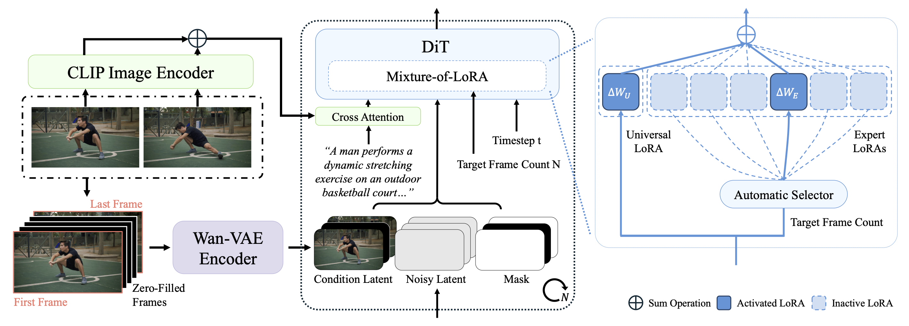

# Semantic Frame Interpolation

### [Project Page](https://hyj542682306.github.io/sfi/) | [Paper](https://arxiv.org/pdf/2507.05173) | [Dataset](https://huggingface.co/datasets/oyiya/SFI-300K)

Official implementation of SemFi in Semantic Frame Interpolation.

Yijia Hong<sup>1,2</sup>, Jiangning Zhang<sup>3,4</sup>, [Ran Yi](https://yiranran.github.io/)<sup>1</sup>, Yuji Wang<sup>1</sup>, Weijian Cao<sup>4</sup>, Xiaobin Hu<sup>4</sup>, Zhucun Xue<sup>3</sup>, Yabiao Wang<sup>4</sup>, Chengjie Wang<sup>4</sup>, Lizhuang Ma<sup>1</sup><br>

<sup>1</sup>Shanghai Jiao Tong University, <sup>2</sup>Shanghai Innovation Institute, <sup>3</sup>Zhejiang University, <sup>4</sup>Tencent YouTu Lab



## Installation

**Our code is based on [DiffSynth-Studio](https://github.com/modelscope/DiffSynth-Studio), you can skip this part if you have already installed its environment.**

The code has been tested on Python 3.10.9 and Pytorch 2.6.0.

```jsx
git clone https://github.com/hyj542682306/Semantic-Frame-Interpolation
cd Semantic-Frame-Interpolation
pip install -r requirements.txt
```

## Download Models

1. Please download the Wan2.1-I2V-14B-720P model from [HuggingFace](https://huggingface.co/Wan-AI/Wan2.1-I2V-14B-720P) or [ModelScope](https://www.modelscope.cn/models/Wan-AI/Wan2.1-I2V-14B-720P) and save it to the ```models``` directory.
2. Download LoRA’s checkpoint from [Google Drive](https://drive.google.com/file/d/1pD-fSDG9v1agfbCWTg-FnrZaGpzMOQR8/view?usp=sharing) or [HuggingFace](https://huggingface.co/oyiya/SemFi/tree/main) and save it to the ```ckpts``` directory.

After downloading, the files related to pre-trained models are structured like this:

```
./ckpts
└──semfi.ckpt
./models
└──Wan2.1-I2V-14B-720P
   └──...
```

## Quick Start

You can directly run ```wan_fi_demo.sh``` to generate the example output:

```
sh wan_fi_demo.sh
```

The generated result will be saved to ```videos.mp4```.

Or you can customize the parameters in the run shell to perform your own tests with the following parameter explanations:

- ```--lora```: Path to the pre-trained lora checkpoint.
- ```--prompt```: Prompt to generate.
- ```—-negative_prompt```: Negative prompt to generate.
- ```—-st_img```: Path to the first frame.
- ```—-ed_img```: Path to the last frame.
- ```—-height```: Height of the generated video.
- ```—-width```: Width of the generated video.
- ```—-frame```: Number of the interpolated frames.
- ```—-output```: Output path for the generated video.
- ```—-num_inference_step```: Diffusion denoise steps.
- ```—-seed```: Seed.
- ```—-fps```: FPS of the generated video.

## Acknowledgments

Our project benefits from the amazing open-source projects:

 - [DiffSynth-Studio](https://github.com/modelscope/DiffSynth-Studio)

 - [Wan2.1](https://github.com/Wan-Video/Wan2.1)

 - [Open-Sora](https://github.com/hpcaitech/Open-Sora)

We would like to thank the authors of these projects for their contributions to the community.

## Citation

If you find our work useful in your research, please cite:

```
@misc{hong2025semanticframeinterpolation,
      title={Semantic Frame Interpolation}, 
      author={Yijia Hong and Jiangning Zhang and Ran Yi and Yuji Wang and Weijian Cao and Xiaobin Hu and Zhucun Xue and Yabiao Wang and Chengjie Wang and Lizhuang Ma},
      year={2025},
      eprint={2507.05173},
      archivePrefix={arXiv},
      primaryClass={cs.CV},
      url={https://arxiv.org/abs/2507.05173}, 
}
```